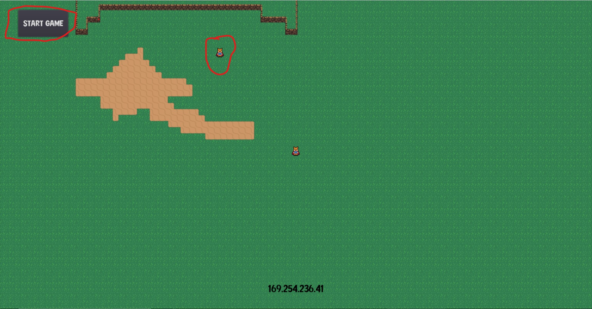
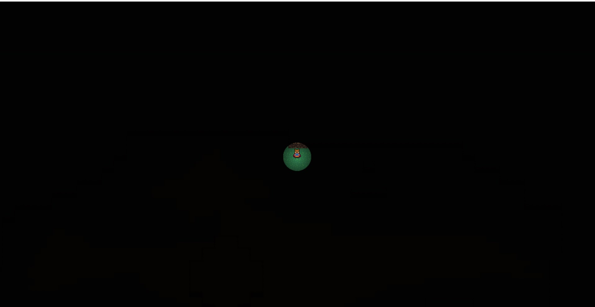

# Laurent Le Bot Beaupré
## peter de geneoux 2022

Ce projet consiste en une preuve de concept que Godot peut faire un jeu en multijoueur pour apprendre comment le jeu se comportait dans les cas de sevrer et de client.
J’ai remarqué que l'on devait utiliser l’adresse ipv4 comme dans le jeu Diablo 2.

La capacité a un jeu à être en multijoueur peut modifier tous les aspects du jeu, car de la manière que je l'ai codé. Chaque joueur a une instance du jeu et ils s’envoient des
Paquets pour mettre à jour la position des différents personnages donc chaque instance de joueurs dans le jeu doit savoir s’il est le propriétaire du joueur pour pouvoir
Utiliser ces fonctionnalités. Il ne faudrait pas que joueur 2 mimique les mouvements de joueur 1car il croie être la même instance.

Nous utilisons le concept de serveur et de client pour connaitre qui doit se connecter a qui dans le jeu le serveur initialise le jeu et le client doit se connecter de manière
Manuel en rentrant l'adresse ipv4 wifi du server une fois les joueurs connectent ils attendent dans le lobby que le joueur serveur commence le jeu en appuyant sur le bouton "start game"

Dans ce la lumière est utilisée surprendre les autres joueurs et faire des attaques-surprises. Chaque joueur a une petite aura autour d'eux qui éclaire le décore chaque joueur.
Ne vois pas l'aura des autres joueurs. Et appuyer sur "e" fait grossir l'aura pendant une courte période et après la capacité a un cooldown de 5 secondes.

ce model de client server a été insporé de la série de tutoriel YouTube réalisé par [PlugWorld](https://www.youtube.com/watch?v=lpkaMKE081M&list=PL6bQeQE-ybqDmGuN7Nz4ZbTAqyCMyEHQa&index=1)

les decors et le personage utilisé dans mon jeu on été inspiré de la série de tu toriel YouTube [HeartBeat](https://www.youtube.com/watch?v=mAbG8Oi-SvQ&list=PL9FzW-m48fn2SlrW0KoLT4n5egNdX-W9a)

les lumiere ont été inspiré de la video [2D Lighting and Day&Night cycle in under 5 minutes! Godot 3.2 Tutorial](https://www.youtube.com/watch?v=j_FMsL_ru1w&t=143s)

#server en attante

<table>
    <tr>
        <td>
            <figure>
                
                <figcaption>Figure 1 : le sereur en attente de joueur</figcaption>
            </figure>
        </td>
        <td>
            <figure>
                
                <figcaption>Figure 2 : tout les joueur sont la et la parti est prete a être lancer</figcaption>
            </figure>
        </td>
    </tr>
</table>

#in game mecanique

<table>
    <tr>
        <td>
            <figure>
                
                <figcaption>Figure 1 : les joueur sont tout les deux dans le noir et il faut chercher les autre joueurs pour les tuer en un coup.</figcaption>
            </figure>
        </td>
        <td>
            <figure>
                
                <figcaption>Figure 2 :les joueurs peuvent appuyer sur "E" pour acivé une capacité pour voir plus loing et avoir des informations pour surprendre l'adversaire.</figcaption>
            </figure>
        </td>
    </tr>
</table>

##manuel de jeu 

-pour commencer les joueurs entre un nom dans le text edit "entré un username"

-ensuite choisisé "entre crée un server" ou "rejoindre un server"

-crée un server crée un lobby et vous attendez des joueur en essayant les diferant mouvemant du persoonage

-le boutton "rejoindre un server" vous amene dans une page pour trouvé un server la recherche automatique est actuelement hors d'usage donc utilisé le bouton manuel 

# si vous le testé avec l'I.D.E godot et non en executable .exe assurez vous que les export sont telechargé 

  <figure>
    
    <figcaption>Figure 1 : si le texte est rouge comme sur l'image suivre la video de ce lien https://www.youtube.com/watch?v=9WwKs3q-ebo si joint apartir de 24:00 minute. cela evite les erreur de port deja pris </figcaption>
  </figure>

-pour la connection manuel rentré ladress ipv4 wifi du server et clicker sur le bouton join lance le jeu dans le loby du server  

-une foit tout les joueur arrivé le serveur lance le jeu en clican sur le bouton start game 

a noté que si vous voulez changer le nombre de  joueur maximal il y a une variable dans lefichier network qui gere le nombre de client maximal priere de ne pas depassé 4 car le jeu nes pas fait pour plus 

les regle jeu sont simple 
- vous ete dans le noir cherchez les autre joueur et tues les il peuve respawn a l'infini dans le jeu mais il peuve aussi quité sa que ce soit notifier 

finalement le debug mode s'active en apuyan sur "g"
